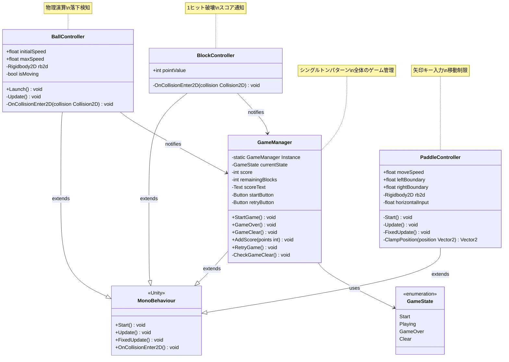
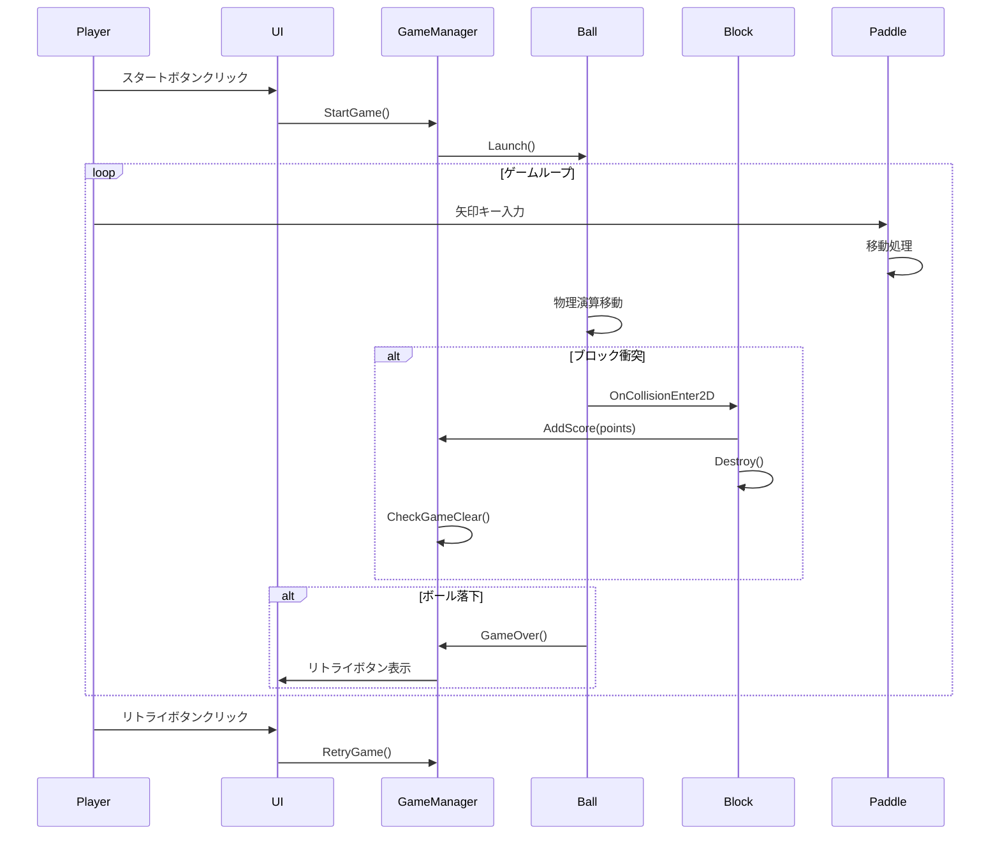

# 実装仕様書

## 1. 実装概要

### 1.1 問題の定義と背景
- Unityで動作するシンプルなブロック崩しゲームの実装
- 2D物理演算を活用した直感的なゲームプレイ
- uLoopMCPのexecute-dynamic-codeを使用してシーンとPrefabを操作

### 1.2 提案ソリューションの概要
- Unity 2Dプロジェクトでの実装
- RigidBody2Dによる物理演算
- シンプルな1ボール制（ミスで即ゲームオーバー）
- 矢印キーによるパドル操作
- スタート/リトライ機能付きUI

### 1.3 機能要件
#### 必須機能
- パドルの左右移動（矢印キー操作）
- ボールの物理演算による移動と反射
- ブロックの配置と破壊（1ヒットで破壊）
- スコア表示
- ゲーム開始ボタン
- ゲームオーバー時のリトライボタン
- 全ブロック破壊による勝利判定
- ボール落下による即座のゲームオーバー

#### オプション機能
- なし（シンプルな実装を優先）

#### 非機能要件
- 60FPS以上での安定動作
- 1024×768以上の解像度対応
- 即座の入力レスポンス

## 2. 実装手順

| 順序 | 作業内容 | 詳細手順 | 確認方法 |
|------|----------|----------|----------|
| 1 | プロジェクト準備 | Scriptsフォルダ作成、Prefabsフォルダ作成 | フォルダ構造の確認 |
| 2 | スクリプト作成 | GameManager.cs、PaddleController.cs、BallController.cs、BlockController.cs作成 | コンパイルエラーなし |
| 3 | シーン作成 | uLoopMCPでBlock.unityシーン作成、カメラ設定（Orthographic） | シーンロード確認 |
| 4 | ゲームオブジェクト配置 | パドル、ボール、壁、ブロック配置 | Scene viewで視覚確認 |
| 5 | Prefab作成 | BlockPrefab、PaddlePrefab、BallPrefab作成 | Prefabアセット確認 |
| 6 | UI実装 | Canvas、スコアText、Start/RetryButton配置 | UI表示確認 |
| 7 | ゲームロジック実装 | 状態管理、衝突処理、スコア計算 | プレイテスト |
| 8 | 統合テスト | 全機能の動作確認、バグ修正 | 完全なゲームプレイ可能 |

## 3. ファイル構造

### 3.1 新規作成ファイル

```
Assets/
├── Scripts/
│   ├── GameManager.cs
│   ├── PaddleController.cs
│   ├── BallController.cs
│   └── BlockController.cs
├── Prefabs/
│   ├── BlockPrefab.prefab
│   ├── PaddlePrefab.prefab
│   └── BallPrefab.prefab
└── Scenes/
    └── Block.unity
```

| ファイルパス | 目的 | 主要な責務 |
|-------------|------|------------|
| Assets/Scripts/GameManager.cs | ゲーム全体管理 | 状態管理、スコア管理、UI制御 |
| Assets/Scripts/PaddleController.cs | パドル制御 | 入力処理、移動制限 |
| Assets/Scripts/BallController.cs | ボール制御 | 初期発射、速度管理、落下検知 |
| Assets/Scripts/BlockController.cs | ブロック制御 | 衝突検知、破壊処理、スコア通知 |
| Assets/Prefabs/BlockPrefab.prefab | ブロックのテンプレート | 再利用可能なブロック |
| Assets/Prefabs/PaddlePrefab.prefab | パドルのテンプレート | プレイヤー操作オブジェクト |
| Assets/Prefabs/BallPrefab.prefab | ボールのテンプレート | 物理演算オブジェクト |
| Assets/Scenes/Block.unity | メインゲームシーン | ゲームプレイ環境 |

### 3.2 変更対象ファイル

| ファイルパス | 変更内容 | 影響範囲 |
|-------------|----------|----------|
| なし | 新規プロジェクトのため変更なし | - |

## 4. 実装対象のクラス・メソッド定義

### 4.1 クラス定義

#### GameManager
- **パス**: `Assets/Scripts/GameManager.cs`
- **概要**: ゲーム全体の状態管理とUI制御を担当するシングルトン
- **継承**: MonoBehaviour
- **インターフェース**: なし

**メソッド一覧**:
| メソッドシグネチャ | 概要 | パラメータ | 戻り値 | 例外 |
|-------------------|------|------------|--------|------|
| `public void StartGame()` | ゲーム開始処理 | なし | void | なし |
| `public void GameOver()` | ゲームオーバー処理 | なし | void | なし |
| `public void GameClear()` | ゲームクリア処理 | なし | void | なし |
| `public void AddScore(int points)` | スコア加算 | points: 加算するポイント | void | なし |
| `public void RetryGame()` | ゲームリトライ | なし | void | なし |
| `private void CheckGameClear()` | クリア条件判定 | なし | void | なし |

**プロパティ一覧**:
| プロパティ名 | 型 | アクセスレベル | 概要 |
|-------------|-----|---------------|------|
| Instance | GameManager | public static get; private set; | シングルトンインスタンス |
| currentState | GameState | private | 現在のゲーム状態 |
| score | int | private | 現在のスコア |
| remainingBlocks | int | private | 残りブロック数 |

**サンプルコード**:
```csharp
// ゲーム開始
GameManager.Instance.StartGame();

// スコア加算
GameManager.Instance.AddScore(10);

// ゲームオーバー判定
if (ballFellDown)
{
    GameManager.Instance.GameOver();
}
```

#### PaddleController
- **パス**: `Assets/Scripts/PaddleController.cs`
- **概要**: パドルの移動制御と境界チェック
- **継承**: MonoBehaviour
- **インターフェース**: なし

**メソッド一覧**:
| メソッドシグネチャ | 概要 | パラメータ | 戻り値 | 例外 |
|-------------------|------|------------|--------|------|
| `private void Start()` | 初期化処理 | なし | void | なし |
| `private void Update()` | 入力取得 | なし | void | なし |
| `private void FixedUpdate()` | 物理移動処理 | なし | void | なし |
| `private Vector2 ClampPosition(Vector2 position)` | 位置制限 | position: 目標位置 | Vector2 | なし |

**プロパティ一覧**:
| プロパティ名 | 型 | アクセスレベル | 概要 |
|-------------|-----|---------------|------|
| moveSpeed | float | public | 移動速度（デフォルト: 10f） |
| leftBoundary | float | public | 左境界（デフォルト: -8f） |
| rightBoundary | float | public | 右境界（デフォルト: 8f） |

#### BallController
- **パス**: `Assets/Scripts/BallController.cs`
- **概要**: ボールの物理制御と落下検知
- **継承**: MonoBehaviour
- **インターフェース**: なし

**メソッド一覧**:
| メソッドシグネチャ | 概要 | パラメータ | 戻り値 | 例外 |
|-------------------|------|------------|--------|------|
| `public void Launch()` | ボール発射 | なし | void | なし |
| `private void Update()` | 落下チェック | なし | void | なし |
| `private void OnCollisionEnter2D(Collision2D collision)` | 衝突処理 | collision: 衝突情報 | void | なし |

**プロパティ一覧**:
| プロパティ名 | 型 | アクセスレベル | 概要 |
|-------------|-----|---------------|------|
| initialSpeed | float | public | 初期速度（デフォルト: 5f） |
| maxSpeed | float | public | 最大速度（デフォルト: 15f） |
| isMoving | bool | private | 移動中フラグ |

#### BlockController
- **パス**: `Assets/Scripts/BlockController.cs`
- **概要**: ブロックの破壊処理とスコア通知
- **継承**: MonoBehaviour
- **インターフェース**: なし

**メソッド一覧**:
| メソッドシグネチャ | 概要 | パラメータ | 戻り値 | 例外 |
|-------------------|------|------------|--------|------|
| `private void OnCollisionEnter2D(Collision2D collision)` | 衝突検知と破壊 | collision: 衝突情報 | void | なし |

**プロパティ一覧**:
| プロパティ名 | 型 | アクセスレベル | 概要 |
|-------------|-----|---------------|------|
| pointValue | int | public | 破壊時の獲得ポイント（デフォルト: 10） |

### 4.2 クラス構造図（Mermaid）



## 5. 依存関係

### 5.1 継承クラス
| 基底クラス | パス | 継承目的 | オーバーライドメソッド |
|-----------|------|---------|---------------------|
| MonoBehaviour | UnityEngine | Unity コンポーネント機能 | Start, Update, FixedUpdate, OnCollisionEnter2D |

### 5.2 使用クラス
| クラス名 | パス | 使用目的 | 使用方法 |
|---------|------|---------|---------|
| Rigidbody2D | UnityEngine | 物理演算 | ボールとパドルの移動制御 |
| BoxCollider2D | UnityEngine | 衝突判定 | パドル、ブロック、壁のコライダー |
| CircleCollider2D | UnityEngine | 衝突判定 | ボールのコライダー |
| Text | UnityEngine.UI | UI表示 | スコア表示 |
| Button | UnityEngine.UI | UI操作 | スタート、リトライボタン |
| Input | UnityEngine | 入力取得 | 矢印キー入力 |

### 5.3 依存関係図
```
GameManager (Singleton)
     ↑
     ├── BallController (GameOver通知)
     └── BlockController (スコア通知)

PaddleController → Input System → Rigidbody2D
BallController → Rigidbody2D → Collision Detection
BlockController → Collision Detection → GameManager
```

## 6. コーディング規約

### 6.1 命名規則
| 対象 | 規則 | 良い例 | 悪い例 |
|------|------|--------|--------|
| クラス | PascalCase | GameManager | game_manager |
| メソッド | PascalCase | StartGame | start_game |
| プライベートフィールド | camelCase | isMoving | IsMoving |
| パブリックフィールド | camelCase | moveSpeed | MoveSpeed |
| 定数 | UPPER_SNAKE_CASE | MAX_SPEED | maxSpeed |

### 6.2 コーディングパターン

#### シングルトンパターン
```csharp
public class GameManager : MonoBehaviour
{
    private static GameManager _instance;
    public static GameManager Instance
    {
        get
        {
            if (_instance == null)
            {
                _instance = FindObjectOfType<GameManager>();
            }
            return _instance;
        }
    }

    private void Awake()
    {
        if (_instance != null && _instance != this)
        {
            Destroy(gameObject);
        }
        else
        {
            _instance = this;
        }
    }
}
```

#### 物理演算移動パターン
```csharp
private void FixedUpdate()
{
    float horizontal = Input.GetAxisRaw("Horizontal");
    Vector2 velocity = new Vector2(horizontal * moveSpeed, 0);
    rb2d.velocity = velocity;

    Vector2 clampedPosition = rb2d.position;
    clampedPosition.x = Mathf.Clamp(clampedPosition.x, leftBoundary, rightBoundary);
    rb2d.MovePosition(clampedPosition);
}
```

## 7. ライブラリ使用仕様

### 7.1 UnityEngine
| API | シグネチャ | 使用例 | 既存使用箇所 |
|-----|-----------|--------|-------------|
| Input.GetAxisRaw | `float GetAxisRaw(string axisName)` | `Input.GetAxisRaw("Horizontal")` | InputManager.asset |
| Rigidbody2D.velocity | `Vector2 velocity { get; set; }` | `rb2d.velocity = new Vector2(x, y)` | - |
| GameObject.FindObjectOfType | `T FindObjectOfType<T>()` | `FindObjectOfType<GameManager>()` | - |

### 7.2 UnityEngine.UI
| API | シグネチャ | 使用例 | 既存使用箇所 |
|-----|-----------|--------|-------------|
| Button.onClick | `ButtonClickedEvent onClick` | `button.onClick.AddListener(Method)` | - |
| Text.text | `string text { get; set; }` | `scoreText.text = "Score: " + score` | - |

### 7.3 uLoopMCP
| API | シグネチャ | 使用例 | 既存使用箇所 |
|-----|-----------|--------|-------------|
| execute-dynamic-code | `Code: string, Parameters: Dictionary` | シーン作成、Prefab生成 | .mcp.json設定済み |

## 8. 参照ドキュメント

| ドキュメント | パス | 関連セクション | 参照目的 |
|-------------|------|---------------|----------|
| Unity C# Reference | unity-cs-reference/ | Physics2D, Input, UI | API仕様確認 |
| Project Settings | ProjectSettings/ | Physics2DSettings, InputManager | 設定値確認 |
| Package Manifest | Packages/manifest.json | Dependencies | 利用可能パッケージ確認 |

## 9. 類似実装の参考

| 実装 | パス | 概要 | 適用可能なパターン |
|------|------|------|------------------|
| Unity 2D Physics | unity-cs-reference/Modules/Physics2D/ | 2D物理演算システム | Rigidbody2D, Collider2D使用法 |
| Unity Input System | unity-cs-reference/Modules/InputLegacy/ | 入力システム | GetAxis, GetAxisRaw使用法 |

## 10. アーキテクチャとフロー

### 10.1 処理フロー
```
1. ゲーム起動
     ↓
2. スタートボタン表示
     ↓
3. スタートボタン押下
     ↓
4. ゲーム開始（ボール発射）
     ↓
5. ゲームループ
   - パドル移動（入力処理）
   - ボール移動（物理演算）
   - 衝突判定
   - ブロック破壊 → スコア加算
     ↓
6. 終了条件判定
   - ボール落下 → ゲームオーバー
   - 全ブロック破壊 → ゲームクリア
     ↓
7. リトライボタン表示
     ↓
8. 2に戻る
```

### 10.2 シーケンス図（Mermaid）


## 11. 影響範囲

| 影響を受ける機能 | 影響の内容 | 影響レベル | 軽減策 |
|----------------|-----------|-----------|--------|
| なし | 新規実装のため影響なし | - | - |

## 12. 注意事項

| カテゴリ | 注意点 | 詳細説明 | 防止策 |
|---------|--------|---------|--------|
| パフォーマンス | オブジェクト生成 | 実行時の動的生成を避ける | 起動時に全ブロック生成 |
| 物理演算 | 速度制限 | ボールが速くなりすぎる可能性 | maxSpeed制限の実装 |
| 入力処理 | フレームレート依存 | UpdateとFixedUpdateの使い分け | 入力はUpdate、移動はFixedUpdate |
| UI | 解像度対応 | 異なる画面サイズでの表示 | CanvasScaler設定 |

## 13. 受け入れ条件

| 条件 | 詳細 | 検証方法 | 期待結果 |
|------|------|---------|---------|
| 基本動作 | パドル操作、ボール反射、ブロック破壊 | 手動プレイテスト | 全機能正常動作 |
| 勝利条件 | 全ブロック破壊でクリア | ブロック全破壊 | クリア表示 |
| 敗北条件 | ボール落下でゲームオーバー | ボール落下させる | ゲームオーバー表示 |
| リトライ機能 | リトライボタンで再開 | ボタンクリック | ゲームリセット |
| パフォーマンス | 60FPS維持 | Stats表示確認 | 60FPS以上 |
| コンパイル | エラー・警告なし | Unity Console確認 | エラー0、警告0 |