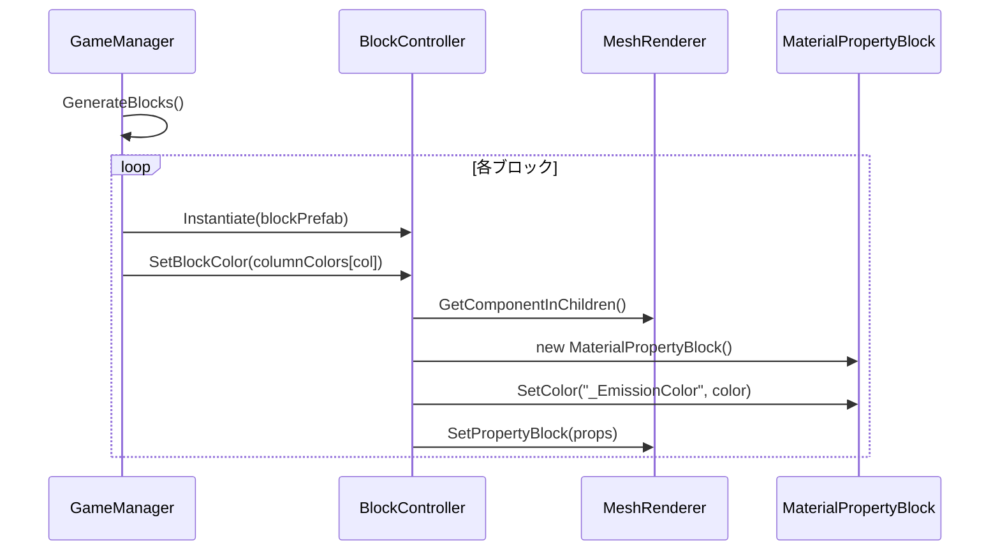

# 実装仕様書

## 1. 実装概要

### 1.1 問題の定義と背景
- 現在のブロック崩しゲームは基本的な視覚表現のみ
- カメラ背景が薄い青紫色で、視覚的なインパクトが不足
- ブロックが単色で、列ごとの差別化がない
- Post Processing効果が未実装で、発光表現がない

### 1.2 提案ソリューションの概要
- カメラ背景を真っ黒に変更して視覚的コントラストを強化
- Post Processing VolumeとBloomエフェクトを追加
- ブロックを列ごとに異なるネオンカラーで発光させる
- 全体的に統一感のあるネオン風ビジュアルを実現

### 1.3 機能要件
**必須機能:**
- カメラ背景の黒色設定
- Global Volume追加とBloomエフェクト設定
- ブロックの列ごとの色分けと発光
- ボールとパドルのマテリアル統一

**非機能要件:**
- モバイル対応のパフォーマンス最適化
- 60FPS維持
- ドローコール最小化

## 2. 実装手順

| 順序 | 作業内容 | 詳細手順 | 確認方法 |
|------|----------|----------|----------|
| 1 | マテリアル作成 | URP/Litシェーダーを使用した発光マテリアル作成、Emissionキーワード有効化 | マテリアルインスペクターで設定確認 |
| 2 | スクリプト修正 | BlockController.SetBlockColorをMeshRenderer対応に修正 | コンパイルエラーなし |
| 3 | GameManager拡張 | 色配列追加、GenerateBlocks()での色設定実装 | ブロック生成時の色確認 |
| 4 | シーン設定 | カメラ背景色変更、Global Volume追加 | シーンビューで視覚確認 |
| 5 | Post Processing設定 | Bloom設定の調整、パフォーマンス最適化 | Game Viewで発光効果確認 |

## 3. ファイル構造

### 3.1 新規作成ファイル

```
Assets/
├── Materials/
│   ├── BlockEmissiveMaterial.mat
│   ├── BallEmissiveMaterial.mat
│   └── PaddleEmissiveMaterial.mat
```

| ファイルパス | 目的 | 主要な責務 |
|-------------|------|------------|
| Assets/Materials/BlockEmissiveMaterial.mat | ブロック用発光マテリアル | URP/Lit、Emission有効、HDR色対応 |
| Assets/Materials/BallEmissiveMaterial.mat | ボール用発光マテリアル | 統一感のある白色発光 |
| Assets/Materials/PaddleEmissiveMaterial.mat | パドル用発光マテリアル | 統一感のある白色発光 |

### 3.2 変更対象ファイル

| ファイルパス | 変更内容 | 影響範囲 |
|-------------|----------|----------|
| Assets/Scripts/BlockController.cs | SetBlockColorメソッドをMeshRenderer対応に修正 | ブロックの色設定機能 |
| Assets/Scripts/GameManager.cs | 色配列追加、GenerateBlocks()で色設定 | ブロック生成処理 |
| Assets/Scenes/Block.unity | カメラ設定変更、Global Volume追加 | シーン全体の視覚効果 |
| Assets/Settings/DefaultVolumeProfile.asset | Bloom設定の有効化と調整 | Post Processing効果 |

## 4. 実装対象のクラス・メソッド定義

### 4.1 クラス定義

#### BlockController
- **パス**: `Assets/Scripts/BlockController.cs`
- **概要**: ブロックの動作と視覚設定を管理
- **継承**: MonoBehaviour

**メソッド一覧**:

| メソッドシグネチャ | 概要 | パラメータ | 戻り値 | 例外 |
|-------------------|------|------------|--------|------|
| `public void SetBlockColor(Color color)` | ブロックの色と発光を設定 | color: HDR色値 | void | なし |

**修正内容**:
```csharp
public void SetBlockColor(Color color)
{
    MeshRenderer meshRenderer = GetComponentInChildren<MeshRenderer>();
    if (meshRenderer != null)
    {
        MaterialPropertyBlock props = new MaterialPropertyBlock();
        meshRenderer.GetPropertyBlock(props);
        props.SetColor("_BaseColor", color);
        props.SetColor("_EmissionColor", color);
        meshRenderer.SetPropertyBlock(props);
    }
}
```

#### GameManager
- **パス**: `Assets/Scripts/GameManager.cs`
- **概要**: ゲーム全体の管理とブロック生成
- **継承**: MonoBehaviour

**追加プロパティ**:

| プロパティ名 | 型 | アクセスレベル | 概要 |
|-------------|-----|---------------|------|
| columnColors | Color[] | private static readonly | 列ごとのネオンカラー配列 |

**修正メソッド**:

| メソッドシグネチャ | 概要 | 変更内容 |
|-------------------|------|----------|
| `private void GenerateBlocks()` | ブロック生成と配置 | 列インデックスに基づく色設定追加 |

## 5. 依存関係

### 5.1 使用クラス

| クラス名 | 使用目的 | 使用方法 |
|---------|---------|---------|
| MaterialPropertyBlock | パフォーマンス最適化 | マテリアルインスタンス化を回避 |
| MeshRenderer | 3D描画 | ブロックの視覚表現 |
| Color | 色管理 | HDR色値の設定 |

### 5.2 依存関係図

```
GameManager
    ↓ 生成・色設定
BlockController
    ↓ 使用
MeshRenderer ← MaterialPropertyBlock
```

## 6. コーディング規約

### 6.1 命名規則

| 対象 | 規則 | 良い例 | 悪い例 |
|------|------|--------|--------|
| プロパティ | PascalCase | EmissionColor | emissionColor |
| プライベートフィールド | camelCase | columnColors | ColumnColors |
| メソッド | PascalCase | SetBlockColor | setblockcolor |

## 7. ライブラリ使用仕様

### 7.1 Unity標準API

| API | シグネチャ | 使用例 |
|-----|-----------|--------|
| Camera.clearFlags | `CameraClearFlags clearFlags { get; set; }` | `camera.clearFlags = CameraClearFlags.SolidColor;` |
| Camera.backgroundColor | `Color backgroundColor { get; set; }` | `camera.backgroundColor = Color.black;` |
| MaterialPropertyBlock.SetColor | `void SetColor(string name, Color value)` | `props.SetColor("_EmissionColor", color);` |

## 8. 参照ドキュメント

| ドキュメント | パス | 関連セクション | 参照目的 |
|-------------|------|---------------|----------|
| Unity URP Documentation | Unity公式ドキュメント | Post Processing | Bloom設定の詳細 |
| MaterialPropertyBlock | Unity Scripting API | Rendering | パフォーマンス最適化 |

## 9. 類似実装の参考

| 実装 | 概要 | 適用可能なパターン |
|------|------|------------------|
| URP Sample Scene | URPのPost Processing設定例 | Volume設定パターン |
| Unity 2D Breakout Tutorial | ブロック崩しの基本実装 | ゲームロジック |

## 10. アーキテクチャとフロー

### 10.1 処理フロー

```
1. GameManager.Start()
      ↓
2. GenerateBlocks()
      ↓
3. ブロック生成ループ
      ↓
4. 列インデックスから色取得
      ↓
5. BlockController.SetBlockColor()
      ↓
6. MaterialPropertyBlock設定
      ↓
7. MeshRenderer適用
```

### 10.2 シーケンス図（Mermaid）



## 11. 影響範囲

| 影響を受ける機能 | 影響の内容 | 影響レベル | 軽減策 |
|----------------|-----------|-----------|--------|
| ゲーム全体の視覚 | 背景が黒になり全体的に暗くなる | 中 | 発光効果で視認性確保 |
| パフォーマンス | Post Processingによる負荷増加 | 低 | 中品質設定で最適化 |
| ブロック描画 | マテリアル変更によるドローコール | 低 | MaterialPropertyBlock使用 |

## 12. 注意事項

| カテゴリ | 注意点 | 詳細説明 | 防止策 |
|---------|--------|---------|--------|
| パフォーマンス | MaterialPropertyBlock再利用 | 毎フレーム生成を避ける | 初期化時のみ設定 |
| 互換性 | URP設定確認 | HDRが有効である必要 | PC_RPAsset.assetで確認 |
| 視覚効果 | Bloom強度調整 | 過度な発光は視認性低下 | intensity 0.5程度に制限 |

## 13. 受け入れ条件

| 条件 | 詳細 | 検証方法 | 期待結果 |
|------|------|---------|---------|
| カメラ背景 | 真っ黒に設定 | Game View確認 | RGB(0,0,0)の黒背景 |
| ブロック発光 | 8列それぞれ異なる色で発光 | Play Mode実行 | ネオンカラーの発光確認 |
| Bloom効果 | 適切な発光表現 | Post Processing確認 | 明るい部分のグロー効果 |
| パフォーマンス | 60FPS維持 | Profiler計測 | フレームレート安定 |

## 14. 実装コード詳細

### 14.1 色配列定義（GameManager.cs）

```csharp
private static readonly Color[] columnColors = new Color[]
{
    new Color(1.0f, 0.1f, 0.1f) * 2.0f,  // Red
    new Color(1.0f, 0.5f, 0.0f) * 2.0f,  // Orange
    new Color(1.0f, 1.0f, 0.2f) * 2.0f,  // Yellow
    new Color(0.2f, 1.0f, 0.2f) * 2.0f,  // Green
    new Color(0.0f, 1.0f, 1.0f) * 2.0f,  // Cyan
    new Color(0.2f, 0.3f, 1.0f) * 2.0f,  // Blue
    new Color(0.8f, 0.2f, 1.0f) * 2.0f,  // Purple
    new Color(1.0f, 0.2f, 0.8f) * 2.0f   // Pink
};
```

### 14.2 GenerateBlocks()修正部分

```csharp
GameObject block = Instantiate(blockPrefab, position, Quaternion.identity);
if (blocksParent != null)
{
    block.transform.SetParent(blocksParent);
}

// 列ごとの色設定を追加
BlockController blockController = block.GetComponent<BlockController>();
if (blockController != null && col < columnColors.Length)
{
    blockController.SetBlockColor(columnColors[col]);
}
```

### 14.3 Bloom設定値

```yaml
Bloom Override設定:
- Active: true
- Threshold: 1.0
- Intensity: 0.5
- Scatter: 0.6
- Clamp: 65472
- High Quality Filtering: false
- Skip Iterations: 1
- Max Iterations: 5
```